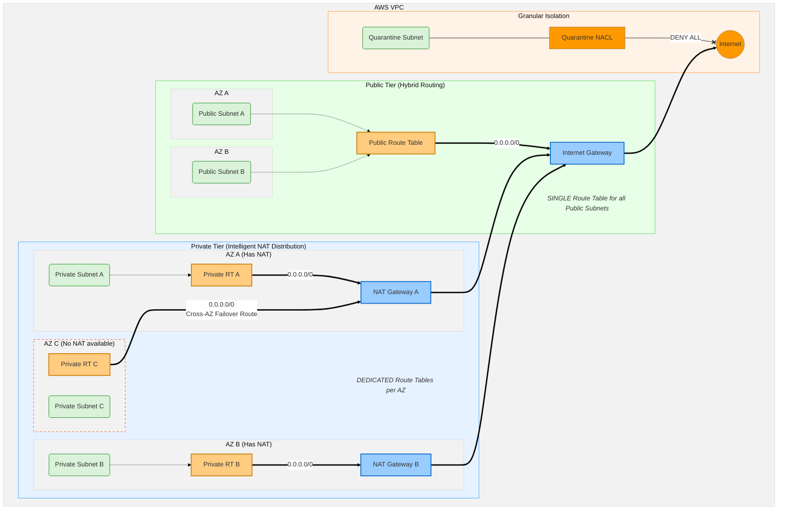

<!-- BEGIN_TF_DOCS -->
# JTFM-Routing
A state-aware Terraform module for advanced AWS traffic engineering. It decouples routing logic from infrastructure creation, enabling automated NAT failover, hybrid route table strategies, and rapid subnet quarantine for security operations.

# Motivation

### The Problem
In traditional "monolithic" network modules, static infrastructure (VPC, Subnets) is often tightly coupled with dynamic routing logic and security rules. This creates three critical operational risks:

* **High Blast Radius:** Routine routing changes require touching the core network state, increasing the risk of accidental subnet destruction.
* **Slow Security Response:** During a breach, isolating a compromised subnet often requires a full infrastructure redeploy or complex manual intervention, delaying containment.
* **Governance Violations:** It is difficult to implement "Separation of Duties" when the same Terraform state controls both the creation of the pipes (NetOps) and the security locks (SecOps).

### The Solution
This module decouples **Network Infrastructure** from **Traffic Engineering & Security**, treating them as separate lifecycles.

* **Lifecycle Decoupling:** Recognizes that VPC CIDRs rarely change, while Route Tables and NACLs change frequently. This split allows for safe, rapid iteration on routing logic without risking the underlying network topology.
* **Operational Readiness:** Includes a dedicated **"Quarantine" mechanism**. In the event of a security incident, the Security Team can target specific subnets for isolation via NACLs without needing full administrative access to the VPC configuration.
* **Least Privilege:** Supports **Separation of Duties** by allowing distinct teams (e.g., NetOps vs. SecOps) to manage connectivity and isolation policies independently via remote state integration.

# Features

* **Dynamic State Integration** : Retrieves VPC network context via S3 remote state or local state files to dynamically generate resources only for active infrastructure.

* **Hybrid Route Table Strategy** : Implements a centralized Route Table for the Public tier (reducing management overhead) while maintaining AZ-specific Route Tables for Private and Database tiers to support granular traffic engineering and high availability.

* **Intelligent NAT Distribution (Cross-AZ Redundancy)** : Uses smart lookup logic (element function) to automatically route traffic. If a specific Availability Zone lacks a dedicated NAT Gateway, it automatically cycles/falls back to an available NAT Gateway in another AZ, ensuring connectivity is never lost.

* **Multi-Layered Network Security** : Goes beyond simple isolation by supporting three distinct NACL association types: Tier-Specific (custom rules per layer), Shared (organization-wide baselines), and Quarantine (rapid subnet isolation for compromised workloads).

## Architecture

## Prerequisites

⚠️ **Dependency Warning:** This module is designed to work in tandem with the [JTFM-Network Module](https://github.com/who1-dev/jtfm-network).

It relies on **Remote State integration** to dynamically discover the VPC ID, Subnet IDs, and Active Availability Zones.
* You must provision `jtfm-network` first.
* This module must have read access to the S3 bucket where `jtfm-network` stores its state file or local file.

## Requirements

| Name | Version |
|------|---------|
|  [terraform](#requirement\_terraform) | >= 1.13.4 |
|  [aws](#provider\_aws) | ~> 6.0 |

## Providers

| Name | Version |
|------|---------|
|  [aws](#provider\_aws) | ~> 6.0 |

## Inputs

> ### State files:
| Name | Description | Type | Default | Required |
|------|-------------|------|---------|:--------:|
|  [local\_network\_source\_path](#input\_local\_network\_source\_path) | Local path to the network terraform state file | `string` | `""` | no |
|  [network\_remote\_state\_config\_bucket](#input\_network\_remote\_state\_config\_bucket) | S3 Bucket name where the remote network state is stored | `string` | `""` | no |
|  [network\_remote\_state\_config\_key](#input\_network\_remote\_state\_config\_key) | S3 Key name where the remote network state is stored | `string` | `""` | no |
> ### Core
| Name | Description | Type | Default | Required |
|------|-------------|------|---------|:--------:|
|  [env](#input\_env) | Deployment environment (e.g., dev, prod) | `string` | `"dev"` | no |
|  [namespace](#input\_namespace) | Project namespace | `string` | n/a | yes |
|  [region](#input\_region) | AWS region to deploy resources | `string` | n/a | yes |
|  [default\_tags](#input\_default\_tags) | Default tags to be applied to all AWS resources | `map(any)` | n/a | yes |

> ### Routing
| Name | Description | Type | Default | Required |
|------|-------------|------|---------|:--------:|
|  [nat\_access](#input\_nat\_access) | Controls outbound internet access via NAT Gateways. Keys must be 'private' or 'database'. Set 'all = true' for all AZs or provide specific short AZ names (e.g., ['1A', '1B']) in the 'azs' list. | <pre>map(object({     all = optional(bool, true)     azs = optional(list(string), [])   }))</pre> | <pre>{   "database": {     "all": true,   },   "private": {     "all": true,    } }</pre> | no |

> ### Subnet Management
| Name | Description | Type | Default | Required |
|------|-------------|------|---------|:--------:|
|  [isolate\_subnets](#input\_isolate\_subnets) | Prevents subnets from being associated with any Route Table, effectively cutting off all routing (Isolation). Keys are tier names ('public', 'private', 'database') and values are lists of subnet keys (e.g., ['1A1', '1B1']). | `map(list(string))` | `{}` | no |
|  [quarantine\_subnets](#input\_quarantine\_subnets) | Subnet specified will be attached with QUARANTINE NACL(blackhole). Keys are tier names ('public', 'private', 'database') and values are lists of subnet keys (e.g., ['1A1', '1B1']) to isolate. | `map(list(string))` | `{}` | no |
|  [shared\_nacl\_associations](#input\_shared\_nacl\_associations) | Maps specific Shared NACLs to subnet tiers. The top-level key is the target NACL name. The nested map links tier names ('public', 'private', 'database') to lists of subnet keys (e.g., ['1A1']). | `map(map(list(string)))` | `{}` | no |

## Resources
| Name | Type |
|------|------|
| [aws_route_table.this](https://registry.terraform.io/providers/hashicorp/aws/latest/docs/resources/route_table) | resource |
| [aws_route_table_association.this](https://registry.terraform.io/providers/hashicorp/aws/latest/docs/resources/route_table_association) | resource |
| [aws_route.public_internet_access](https://registry.terraform.io/providers/hashicorp/aws/latest/docs/resources/route) | resource |
| [aws_route.nat_access](https://registry.terraform.io/providers/hashicorp/aws/latest/docs/resources/route) | resource |
| [aws_network_acl_association.this](https://registry.terraform.io/providers/hashicorp/aws/latest/docs/resources/network_acl_association) | resource |
| [aws_network_acl_association.quarantine](https://registry.terraform.io/providers/hashicorp/aws/latest/docs/resources/network_acl_association) | resource |
| [aws_network_acl_association.shared](https://registry.terraform.io/providers/hashicorp/aws/latest/docs/resources/network_acl_association) | resource |

## Data Resources
| Name | Type |
|------|------|
| [terraform_remote_state.local](https://registry.terraform.io/providers/hashicorp/terraform/latest/docs/data-sources/remote_state) | data source |
| [terraform_remote_state.remote](https://registry.terraform.io/providers/hashicorp/terraform/latest/docs/data-sources/remote_state) | data source |

## Outputs

| Name | Description |
|------|-------------|
|  [route_tables](#output\aws_route_table) | Map containing the ID, ARN, and Owner ID for each created Route Table |

